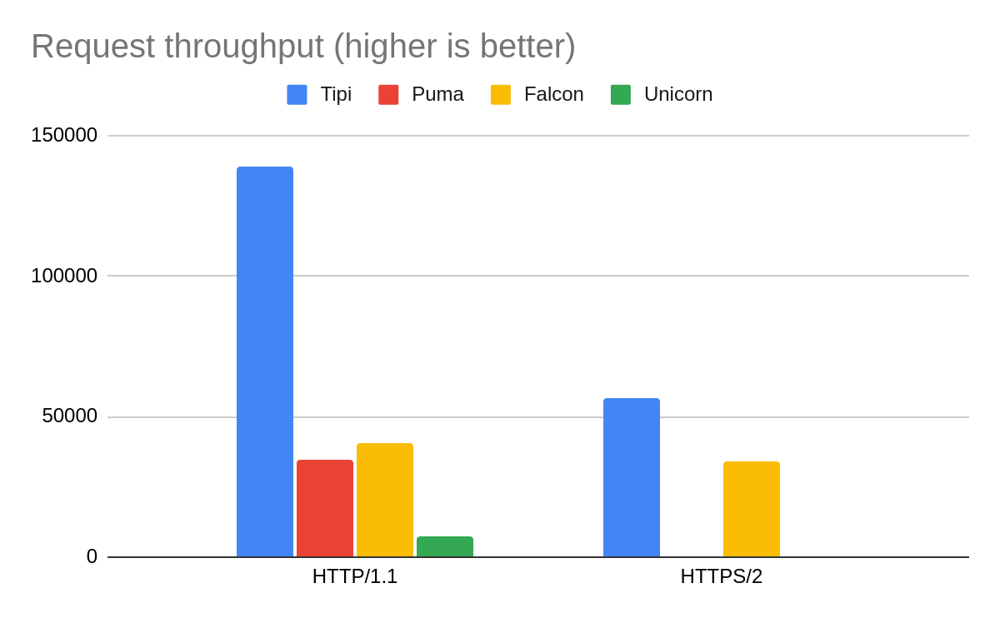

<p align="center"></p>

# Tipi - the All-in-one Web Server for Ruby Apps

[](http://rubygems.org/gems/tipi)
[](https://github.com/digital-fabric/tipi/actions?query=workflow%3ATests)
[](https://github.com/digital-fabric/tipi/blob/master/LICENSE)

## What is Tipi?

Tipi is an integrated, feature-complete HTTP/S server for Ruby applications.
Tipi is built on top of
[Polyphony](https://github.com/digital-fabric/polyphony), a robust,
high-performance library for building highly-concurrent applications in Ruby.
Tipi can be used to serve any Rack application or set of static files directly
without having to employ a reverse-proxy such as Nginx.

## Features

* High-performance, highly concurrent web server based on
  [Polyphony](https://github.com/digital-fabric/polyphony)
* Full support for HTTP/1, HTTP/2, WebSocket protocols
* Built-in SSL termination for secure, encrypted connections
* **Automatic SSL certificates** using ACME providers such as Let's Encrypt (WIP)
* Automatic ALPN protocol selection for serving HTTP/2
* Request and response body streaming for efficient downloads and uploads
* Full support for Rack-based apps

## Benchmarks

> Caveat emptor: the following results were obtained with an ad-hoc, manual
> process. I am not really familiar with the servers I compared Tipi against,
> and I ran them in their default configuration (apart from setting the number
> of workers). Take these results with a bunch of salt.



| |Tipi|Puma|Falcon|Unicorn|
|-|---:|---:|-----:|------:|
|HTTP/1.1|138629|34573|40714|7438|
|HTTPS/2|56762|n/a|34226|n/a|

### Methodology

- All servers ran the same "Hello world" [Rack
  application](https://github.com/digital-fabric/tipi/blob/master/examples/hello.ru)
- Each server was run with 4 forked worker processes:
  - Tipi: `tipi -w4 -flocalhost:10080:10443 examples/hello.ru`
  - [Puma](https://github.com/puma/puma): `puma -w 4 examples/hello.ru`
  - [Falcon](https://github.com/socketry/falcon/): `falcon -n 4 -b http://localhost:9292/ -c examples/hello.ru`
  - [Unicorn](https://yhbt.net/unicorn/): `unicorn -c u.conf examples/hello.ru`
    with the configuration file containing the directive `worker_processes 4`
- The benchmark results were obtained using `wrk -d60 -t4 -c64 <url>`
- All servers were run on Ruby 2.7.2p137
- Machine specs: i5-8350U@1.7GHzx8 CPU, 8GB of RAM, running Linux kernel version 5.13.7
- Puma does not support HTTP/2.
- As far as I could tell Unicorn does not support SSL termination.

## Running Tipi

To run Tipi, run the included `tipi` command. Alternatively you can add tipi as
a dependency to your Gemfile, then run `bundle exec tipi`. By default 

Tipi can be used to drive Rack apps or alternatively any app using the
[Qeweney](https://github.com/digital-fabric/qeweney) request-response interface.

### Running Rack apps

Use the `tipi` command to start your app:

```bash
$ bundle exec tipi myapp.ru
```

### Running Qeweney apps

```bash
$ bundle exec tipi myapp.rb
```

The app script file should define an `app` method that returns a proc/lambda
taking a single `Qeweney::Request` argument. Here's an example:

```ruby
# frozen_string_literal: true

def app
  ->(req) { req.respond('Hello, world!', 'Content-Type' => 'text/plain') }
end
```

## Setting server listening options

By default, Tipi serves plain HTTP on port 1234, but you can easily change that
by providing command line options as follows:

### HTTP

To listen for plain HTTP, use the `-l`/`--listen` option and specify a port
number:

```bash
$ bundle exec tipi -l9292 myapp.ru
```

### HTTPS

To listen for HTTPS connections, use the `-s`/`--secure` option and specify a
host name and a port:

```bash
$ bundle exec tipi -sexample.com:9292 myapp.ru
```

### Full service listening

The Tipi full service listens for both HTTP and HTTPS and supports automatic
certificate provisioning. To use the full service, use the `-f`/`--full` option,
and specify the domain name, the HTTP port, and the HTTPS port, e.g.:

```bash
$ bundle exec tipi -fmysite.org:10080:10443 myapp.ru

#If serving multiple domains, you can use * as place holder
$ bundle exec tipi -f*:10080:10443 myapp.ru
```

If `localhost` is specified as the domain, Tipi will automatically generate a
localhost certificate.

## Concurrency settings

By default, the `tipi` command starts a single controller and uses
[Polyphony](https://github.com/digital-fabric/polyphony) to run each connection
on its own fiber. This means that you will have a single process running on a
single thread (on a single CPU core). In order to parallelize your app and
employ multiple CPU cores, you can tell Tipi to fork multiple worker processes
to run your app. The number of workers is controlled using the `-w`/`--workers`
option:

```bash
# fork 4 worker processes
$ bundle exec tipi -w4 myapp.ru
```

You can also set Tipi to spawn multiple threads in each worker when in
compatibility mode (see below.)

## Compatibility mode

> Note: compatibility mode is still being developed, and currently only supports
> HTTP/1 connections.

In some apps, using Polyphony is not possible, due to incompatibilities between
it and other third-party dependencies. In order to be able to run these apps,
Tipi provides a compatibility mode that does not use Polyphony for concurrency,
but instead uses a thread-per-connection concurrency model. You can also fork
multiple workers, each running multiple threads, if so desired. Note that the
concurrency level is the maximum number workers multiplied by the number of
threads per worker:

```
concurrency = worker_count * threads_per_worker
```

To run Tipi in compatibility mode, use the `-c`/`--compatibility` option, e.g.:

```bash
# 4 workers * 8 threads = 32 max concurrency
$ bundle exec tipi -c -w4 -t8 myapp.ru
```

## Worker process supervision

Tipi employs a supervisor-controller-worker process supervision model, which
minimizes the memory consumption of forked workers, and which facilitates
graceful reloading after updating the application code.

This supervision model is made of three levels:

- Supervisor - Starts and stops the controller process
- Controller - loads the application code and forks workers
- Worker - listens for connections, handles incoming requests

(If the worker count is 1, the Controller and Worker roles are merged into a
single process.)

This model allows Tipi to fork workers after loading the app code, and use a
much simpler way to perform graceful restarts:

- The supervisor starts a new controller process (which may fork one or more
  worker processes).
- Sleep for a certain amount of time (currently 1 second.)
- Stop the old controller process.
- Each worker process is gracefully stopped and allowed to finish all pending
  requests, then shutdown all open connections.
  
## Performing a graceful restart

A graceful restart performed by sending `SIGUSR2` to the supervisor process.

## Documentation

Documentation for Tipi's API is coming soon...

